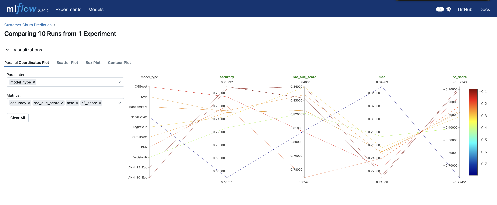
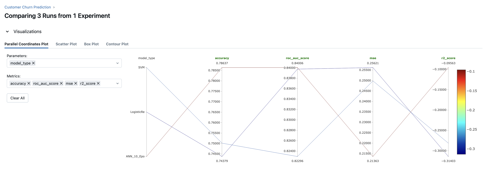
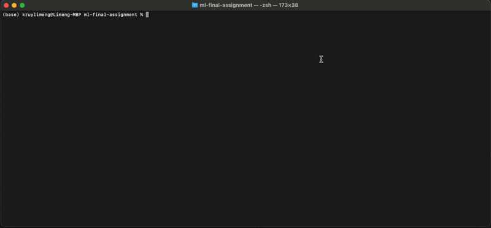
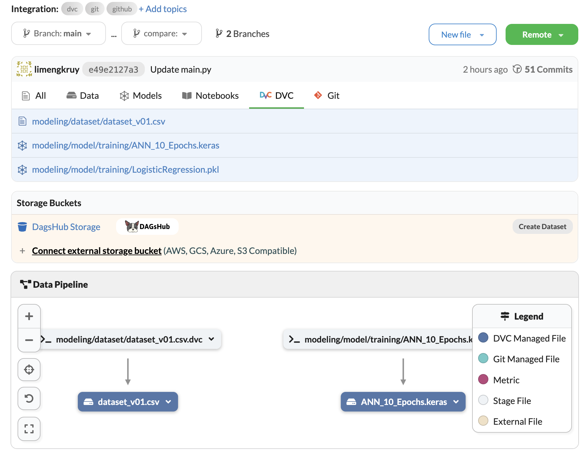
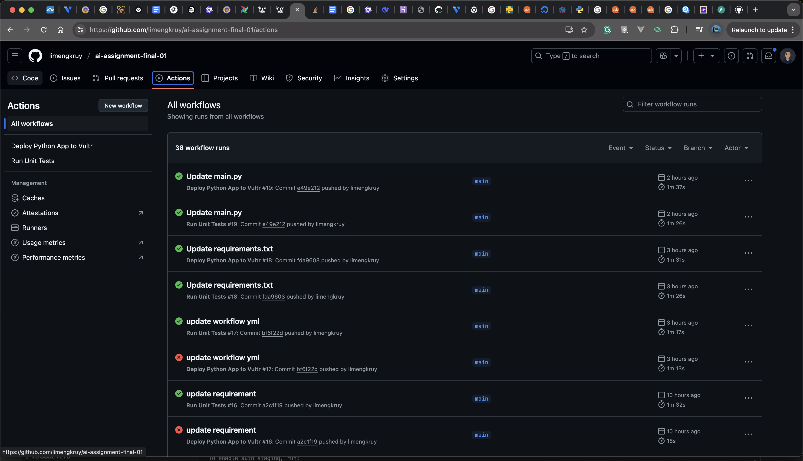
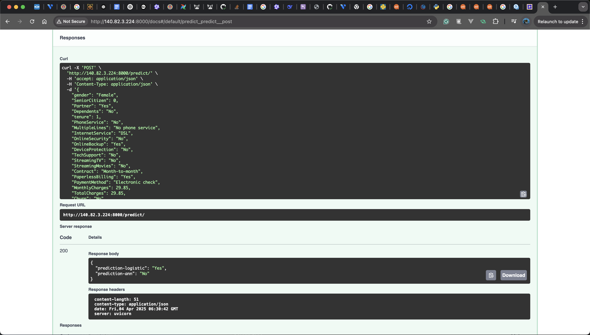

# Customer Churn Prediction with AI 🚀

## Member
  ### 🧑‍💻 Limeng KRUY
  ### 🧑‍💻 Oudom CHHOUN

##


## Overview
Welcome to the **Customer Churn Prediction Project**! 🎯 This AI-powered application uses the **Telco customer dataset** to predict whether a customer is likely to churn. We’ve built a robust machine learning model using **scikit-learn** and deployed it as a web API using **FastAPI**. Whether you’re an aspiring data scientist, a business analyst, or someone interested in customer retention strategies, this project is for you! 🔍

### 💡 **Why Customer Churn Prediction?**
Customer churn is one of the most important metrics for any business. Predicting which customers are at risk of leaving can help companies take action early—improving customer retention strategies, increasing revenue, and fostering long-term growth. This project applies machine learning to solve a real-world business problem.

---

## Tools & Technologies 🛠️

This project uses a collection of powerful tools to make the magic happen:

- **Git & GitHub**: For seamless version control and collaboration 🖥️
- **Scikit-learn**: A go-to library for machine learning in Python 📊
- **FastAPI**: To create an ultra-fast web API to deploy our AI model ⚡
- **Joblib**: To save and reload our trained model 💾
- **Uvicorn**: The lightning-fast ASGI server for running FastAPI ⚡
- **Pandas**: For all things data manipulation 🧑‍💻
- **MLflow**: For track experiments, log models, and manage model versions. 📊
- **DagsHub and DVC**: For track change on dataset and model. 🖥️

---

## 🚀 How to Get Started

Follow these simple steps to get the project up and running locally:

### 🖥️ 1. Clone the repository:
Start by cloning the repository to your local machine:

```bash
git clone https://github.com/limengkruy/ai-assignment-midterm-01.git
cd ai-assignment-midterm-01
```

### ⚡ 2. Install the required dependencies:
```bash
pip install -r requirements.txt
```

### 💾 3. Train the model:
Run the Python script to train the customer churn model and save it to a `.pkl` file:

```bash
cd modeling
python train.py
```

### 📊 4. MLflow Experiment Tracking

#### MLflow Command
Start MLflow UI:

```bash
mlflow ui
```

Access the MLflow UI at: http://127.0.0.1:5000

### ⚡ 5. Start the FastAPI server:
```bash
uvicorn main:app --reload
```

### 🧑‍💻 6. To make predictions, send a POST request to `/predict` with the customer data in JSON format.

#### API Endpoints

- **POST /predict**: Predict customer churn based on the input data.

    Example request:
    ```json
    {
    "gender": "Female",                // Available values: "Female", "Male"
    "SeniorCitizen": 0,                // Available values: 0 (No), 1 (Yes)
    "Partner": "Yes",                  // Available values: "Yes", "No"
    "Dependents": "No",                // Available values: "Yes", "No"
    "tenure": 12,                      // Number of months (integer)
    "PhoneService": "Yes",             // Available values: "Yes", "No"
    "MultipleLines": "No",             // Available values: "No phone service", "No", "Yes"
    "InternetService": "DSL",          // Available values: "DSL", "Fiber optic", "No"
    "OnlineSecurity": "No internet service", // Available values: "No internet service", "No", "Yes"
    "OnlineBackup": "Yes",             // Available values: "No internet service", "No", "Yes"
    "DeviceProtection": "No internet service", // Available values: "No internet service", "No", "Yes"
    "TechSupport": "No internet service", // Available values: "No internet service", "No", "Yes"
    "StreamingTV": "Yes",              // Available values: "No internet service", "No", "Yes"
    "StreamingMovies": "Yes",          // Available values: "No internet service", "No", "Yes"
    "Contract": "Month-to-month",      // Available values: "Month-to-month", "One year", "Two year"
    "PaperlessBilling": "Yes",         // Available values: "Yes", "No"
    "PaymentMethod": "Electronic check", // Available values: "Electronic check", "Mailed check", "Bank transfer (automatic)", "Credit card (automatic)"
    "MonthlyCharges": 55.8,            // Monthly charges as a float
    "TotalCharges": 660.2              // Total charges as a float
    }
    ```

    Example response:
    ```json
    {
        "prediction": "Yes" // Yes or No
    }
    ```


### 7. Result Comparision





### 8. Result FastAPI



### 💾 9. Track Data Changed and Model with DVC
```bash
dvc init
dvc add modeling/dataset/dataset_v01.csv
dvc add modeling/model/training/ANN_10_Epochs.keras
dvc add modeling/model/training/LogisticRegression.pkl
dvc remote add origin https://dagshub.com/limengkruy/ai-assignment-final-01.dvc
dvc remote modify origin --local auth basic 
dvc remote modify origin --local user {username} 
dvc remote modify origin --local password {token}
dvc push
```
- Next Step is to commit and push to GitHub



### ⚡ 10. Add GitHub WorkFlows
- `.github/workflows/test.yml`
- `.github/workflows/deploy.yml`

### ⚡ 11. Create SSH Key
- `ssh-keygen -t rsa -b 4096 -C "yourname@email.com"`
- `cat ~/.ssh/id_rsa.pub` #Public Key
- `cat ~/.ssh/id_rsa` #Private Key

### ⚡ 12. Create Secret Key for Repo
- Go to your GitHub repository.
- Navigate to Settings → Secrets → New repository secret.
- Add each secret mentioned below.

    `SERVER_IP` : Vultr Public IP

    `SERVER_USER` : root or non-root User

    `SSH_PRIVATE_KEY` : Your Private Key

    `DEPLOY_PATH` : Your app path on server [`/opt/python_project`]

### ⚡ 13. Server Setup
- `ssh -i ~/.ssh/id_rsa root@your-server-ip`  #SSH to Server
- `cd /opt`  #Change director to /opt
- `mkdir python_project`  #Create folder `python_project`
- `python -m venv /opt/python_project/venv`  #Create environment for python
- `source /opt/python_project/venv/bin/activate`  #Activate evironment
- `pip install fastapi uvicorn gunicorn`  #Install library
- `nano /etc/systemd/system/myapp.service`  #Create systemd

````bash
[Unit]
Description=Gunicorn instance to serve myapp
After=network.target

[Service]
User=<your-username>
Group=<your-group>
WorkingDirectory=/opt/python_project
ExecStart=/opt/python_project/venv/bin/gunicorn -w 4 -k uvicorn.workers.UvicornWorker main:app --bind 0.0.0.0:8000
Restart=always
Environment="PATH=/opt/python_project/venv/bin"

[Install]
WantedBy=multi-user.target
````

Reload Systemd and Test before make it works
- `systemctl daemon-reload`
- `systemctl start myapp`
- `systemctl enable myapp`
- `systemctl status myapp`

### ⚡ 14. Let's make change on `main` branch on GitHub and see Action Tab


### ⚡ 15. Let's see Result


### 9. Presentation on Model Evaluation
[See Presentation on Google Slides](https://docs.google.com/presentation/d/1sUeIx7PEJGxAEzLBQ_ddtX754laaDt8t2l2EKBu9cC8/edit?usp=sharing)